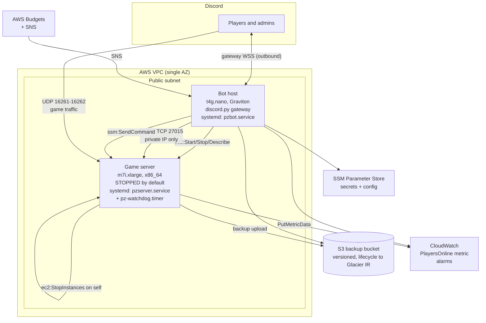
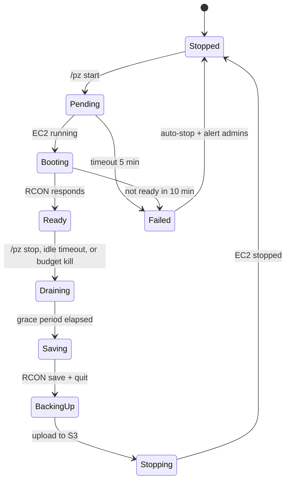

# Project Zomboid on EC2, with a Discord Control Plane

**Status:** Draft for review
**Date:** 2026-08-22
**Owner:** Jon Francisco

> This is the **design of record** — the reasoning, the trade-offs, and the constraints
> that shaped them. It is kept as written rather than edited to match what got built.
> For what actually exists in code, where reality diverged from this document, and how it
> coexists with foodblog in the shared AWS account, see [INFRA.md](INFRA.md); for
> procedures, see [DEPLOY.md](DEPLOY.md).
>
> Known deltas, all explained in INFRA.md: the connect address is
> `pz.joncfrancis.co:16261` rather than a bare IP (which also resolves §5's EIP-vs-DNS
> trade-off in a way this document could not); the mount unit in §8 must be named
> `opt-pz-data.mount`; and the §5 fixed-cost subtotal was missing the bot host's own
> public IPv4, so the real figure is ~$41/month at 4 hr/day rather than ~$37.

---

## 1. Summary

Run a Project Zomboid (PZ) dedicated server on a single EC2 instance that is **stopped by default** and started on demand from Discord. A small always-on bot host holds the Discord gateway connection, so `/pz start` works while the game server is powered off — which is the entire point of the design, since a stopped instance costs nothing but storage.

Two audiences, two permission tiers:

| Tier | Discord role | Can do |
|---|---|---|
| **Player** | `pz-player` | `start`, `status`, `who`, `stop` (with grace), `backup list` |
| **Admin** | `pz-admin` | everything above, plus `stop --force`, `save`, `restart`, `backup now`, `restore`, `config` |

Scope for v1 is deliberately narrow: **lifecycle + cost control + backup/save management**. In-game moderation (kick/ban/teleport/spawn) and Workshop mod management are explicitly deferred to v2 — see [§13](#13-out-of-scope-for-v1).

---

## 2. Goals and non-goals

### Goals

- G1. A 6–8 player PZ server that runs well and is reachable at a stable address.
- G2. Compute cost proportional to actual play time. Target: **under $40/month** at ~4 hours/day, versus ~$160/month running 24/7.
- G3. Anyone in the Discord can bring the server up without touching the AWS console.
- G4. The world save is never lost to an instance failure, a bad mod update, or a fat-fingered command. Recovery point objective (RPO) **≤ 15 minutes**; recovery time objective (RTO) **≤ 10 minutes**.
- G5. A stop — whether requested, idle-triggered, or budget-triggered — **always** saves the world first.
- G6. Everything is Terraform. `terraform destroy` followed by `terraform apply` plus a restore gets the server back.

### Non-goals

- Multi-region, high availability, or auto-scaling. This is one box for a group of friends.
- Zero-downtime updates.
- Supporting more than one PZ world per stack. (The design is per-world; run a second stack for a second world.)
- A web UI. Discord is the UI.

---

## 3. Constraints that shape the design

These are the facts that actually drive the architecture. They are worth stating up front because several of them rule out otherwise-obvious choices.

**C1 — PZ is x86_64 only.** The dedicated server ships native `.so` libraries built for x86. Graviton works only under FEX-Emu or box64 emulation, which is fragile and slow and not something to run a persistent world on. **The game server must be an Intel or AMD instance.** (The *bot* host has no such constraint and should be Graviton.)

**C2 — PZ is heavily single-threaded.** Zombie simulation runs on one hot thread. High clock speed beats core count. This argues for `m7i`/`c7i`/`r7i` (Sapphire Rapids, 3.2 GHz sustained) over cheaper burstable families. A `t3.large` will feel bad once the map opens up.

**C3 — Build 42 is memory-hungry.** Rough sizing is ~6 GB base + ~0.5 GB per player, and RAM use grows with explored map area and uptime, not just player count. A group that was comfortable on 8 GB under B41 should be planned at 12–16 GB under B42. The most common failure is leaving the Java `-Xmx` heap at its default so the JVM OOMs with system RAM still free.

**C4 — Spot and Reserved Instances are both wrong here.** Spot interruptions on a stateful game server mean a hard kill mid-session. Reserved Instances and Savings Plans bill 24/7 regardless of instance state, which cancels out the savings from stopping. **On-demand plus aggressive stopping is the correct cost model**, and this is non-obvious enough that it should be written down so nobody "optimizes" it later.

**C5 — Stopping an instance does not stop all charges.** EBS volumes bill while stopped. A public IPv4 address bills at $0.005/hour (~$3.65/month) whether attached, idle, or on a stopped instance. Budget for a fixed monthly floor of roughly $12 regardless of play hours.

**C6 — `user-data` runs once, not on every boot.** Because the instance is stopped and started rather than terminated and replaced, cloud-init will not re-run. All boot-time behavior must live in **systemd units baked onto the root volume**, not in `user-data`. Getting this wrong is the single most likely way to build something that works once and then silently stops working.

**C7 — RCON is the only remote admin channel.** PZ exposes a Source-style RCON listener (`RCONPort`, default 27015, `RCONPassword` in the server `.ini`). Every admin command — `players`, `save`, `quit`, `servermsg` — works over it without an in-game presence. It is also plaintext with a weak auth handshake, so **it must never be exposed to the internet**.

---

## 4. Architecture



### Why a separate bot host

The bot cannot live on the game server, because the whole product requirement is that `/pz start` works when the game server is off. The alternatives considered:

| Option | Verdict |
|---|---|
| **t4g.nano, always on** | **Chosen.** ~$3.07/month. Persistent gateway connection means no 3-second interaction deadline to design around, long-running operations can stream progress into the same message, and the idle-watchdog logic has a natural home. Graviton is fine — the bot is pure Python. |
| Lambda + API Gateway (HTTP interactions) | Reconsidered 2026-08 (pzbot#13): still no. The bot's RCON probe needs the game server's *private* IP (C7, below) — a Lambda needs VPC attachment to reach it, and a VPC-attached Lambda needs a NAT Gateway to reach Discord's API and AWS's public endpoints (~$32–45/mo), which costs more than the ~$7.36/mo (nano + EIP) it would save. `/pz restore`'s worst case (~70 min across chained SSM calls) also exceeds Lambda's 15-minute limit regardless of transport. The $3/month threshold from the original verdict was reached; the answer didn't change. |
| Fargate task | Same always-on cost profile as the nano but with more infrastructure. No advantage at this scale. |
| On the game server | Fails G3 outright. |

The bot host also gives us a place to reach RCON **over the VPC's private network**, so port 27015 is never opened to the internet (C7).

---

## 5. Sizing and cost model

### Recommended instance

**`m7i.xlarge` — 4 vCPU, 16 GiB, Sapphire Rapids @ 3.2 GHz, $0.202/hr (us-east-1).**

JVM heap set to `-Xmx12g`, leaving ~4 GiB for the OS and page cache. Good for 6–8 players with a modest mod list under B42.

Scale-up path if the world gets large or the group grows:

| Instance | vCPU | RAM | Suggested `-Xmx` | $/hr | Notes |
|---|---|---|---|---|---|
| `m7i.large` | 2 | 8 | 6g | $0.101 | B41-scale only; too tight for B42. |
| **`m7i.xlarge`** | 4 | 16 | 12g | **$0.202** | **Default. 6–8 players.** |
| `r7i.xlarge` | 4 | 32 | 24g | $0.265 | Same clock, double RAM. The right upgrade when B42 memory growth bites — RAM, not cores, is what runs out first. |
| `c7i.2xlarge` | 8 | 16 | 12g | $0.357 | Only if profiling shows CPU-bound, which is unlikely given C2. |

Instance type is a Terraform variable. Changing it is a stop → modify → start, roughly two minutes of downtime, no data movement.

### Monthly cost

Fixed floor, paid regardless of play time:

| Item | Monthly |
|---|---|
| Game server root+data EBS, 60 GB gp3 @ $0.08/GB-mo | $4.80 |
| Elastic IP, $0.005/hr | $3.65 |
| Bot host `t4g.nano` @ $0.0042/hr | $3.07 |
| Bot host EBS, 8 GB gp3 | $0.64 |
| S3 backups, ~5 GB with versioning | ~$0.15 |
| **Fixed subtotal** | **~$12.31** |

Variable, by play hours (`m7i.xlarge` @ $0.202/hr):

| Usage | Hours/mo | Compute | **Total** |
|---|---|---|---|
| 2 hr/day | 60 | $12.12 | **~$24** |
| **4 hr/day** | **120** | **$24.24** | **~$37** |
| 6 hr/day | 180 | $36.36 | **~$49** |
| Weekends only, 8 hr | 64 | $12.93 | **~$25** |
| 24/7 (no stopping) | 730 | $147.46 | **~$160** |

Data transfer out is negligible — PZ uses roughly 5–20 GB/month for a group this size, comfortably inside the 100 GB/month free egress allowance.

**Where the break-even actually sits.** Stopping the instance is not just cheaper than leaving it on — it is cheaper than committing to a discount, which is the alternative someone will inevitably propose:

| Strategy | $/hr | Monthly compute | Cheaper than stop/start above… |
|---|---|---|---|
| On-demand, stopped when idle | $0.202 | varies | — |
| 1-year Reserved / Savings Plan | $0.133 | $97.09 (billed 24/7) | ~16 hr/day of play |
| 3-year Reserved / Savings Plan | $0.091 | $66.43 (billed 24/7) | ~11 hr/day of play |

At the expected 4 hr/day, on-demand plus stopping costs about **a third** of even a 3-year commitment. Only revisit if sustained usage passes ~11 hours/day.

### The EIP question

$3.65/month buys a permanently stable `IP:port` that players paste into the PZ client once and never change. The alternative is a Route 53 A record updated on each boot, which saves the $3.65 but introduces DNS TTL propagation into the start path and a new failure mode ("server is up but nobody can connect yet"). **Recommendation: keep the EIP.** It is the cheapest reliability in the whole stack.

---

## 6. AWS resource inventory

| Resource | Config | Notes |
|---|---|---|
| VPC | 1 VPC, 1 public subnet, IGW | Single AZ. No NAT gateway — that would cost more than the game server. |
| `sg-game` | in: UDP 16261–16262 from `0.0.0.0/0`; TCP 27015 from `sg-bot` only; **no SSH** | Shell access is SSM Session Manager only. |
| `sg-bot` | in: nothing. out: all | Purely a client. |
| EC2 game server | `m7i.xlarge`, x86_64 AL2023 or Ubuntu 24.04 LTS, EIP attached | Tagged `pz:role=gameserver`, `pz:stack=<name>` — IAM policies condition on these tags. |
| EBS root | 30 GB gp3 | OS, SteamCMD, PZ binaries. Rebuildable. |
| EBS data | 30 GB gp3, `DeleteOnTermination=false` | Mounted at `/opt/pz/data` → `~/Zomboid`. Survives an instance rebuild. **This volume is the world.** |
| EC2 bot host | `t4g.nano`, arm64 AL2023 | Tagged `pz:role=bot`. |
| S3 bucket | Versioning on, public access blocked, SSE-S3, lifecycle: Standard 30d → Glacier IR 60d → expire noncurrent 180d | Backup destination. |
| SSM Parameter Store | `/pz/<stack>/*` SecureString | Discord token, RCON password, PZ admin password, role IDs, channel IDs. |
| IAM roles | `pz-gameserver-role`, `pz-bot-role` | See §9. |
| CloudWatch | Custom metric `PZ/PlayersOnline`; alarms on idle, on unexpected stop, on disk >85% | |
| DLM policy | Daily snapshot of the data volume, 7-day retention | Disaster-recovery tier, independent of the S3 backups. |
| AWS Budgets | Monthly budget with 50/80/100% SNS alerts | Wired to the bot for Discord notification. |

**No SSH key pairs anywhere.** Session Manager covers interactive access, `ssm:SendCommand` covers scripted access, and there is no port 22 to be scanned.

---

## 7. Terraform layout

```
infra/
  backend.tf              # S3 remote state, use_lockfile = true (TF >= 1.10, no DynamoDB table needed)
  versions.tf
  main.tf                 # wires the modules together
  variables.tf
  outputs.tf              # eip, instance ids, bucket name, connect string
  prod.tfvars
  modules/
    network/              # vpc, subnet, igw, route table, security groups
    game-server/          # instance, EIP, EBS data volume + attachment, IAM role/profile, AMI lookup
    bot-host/             # instance, IAM role/profile
    backups/              # S3 bucket + policy + lifecycle, DLM policy
    observability/        # CloudWatch alarms, SNS topic, Budgets
  bootstrap/              # golden-image build (Packer) or first-boot provisioning scripts
```

### Conventions

- **Secrets never enter Terraform state.** SSM parameters are created out of band (`aws ssm put-parameter`) and read at runtime by the instances via their IAM roles. Terraform manages the *parameter names and IAM access*, not the values. A `data "aws_ssm_parameter"` lookup would pull plaintext into state — do not use it.
- **State lives in S3** with native S3 locking (`use_lockfile = true`), Terraform 1.10+. Bucket versioned and created by a tiny separate bootstrap stack, not by the main stack.
- **`prevent_destroy = true`** on the EBS data volume and the S3 backup bucket. These two resources are the only ones whose loss is unrecoverable.
- Instance type, `-Xmx`, idle timeout, server name, and mod list are all `variables.tf` inputs.

### The AMI question

Two options for getting a configured host:

1. **Packer golden AMI.** Build once, bake SteamCMD + PZ + systemd units + the watchdog into an AMI, reference it from Terraform. Fast boot, fully reproducible, and rebuild-from-scratch is a one-liner.
2. **Base AMI + first-boot `user-data`.** Simpler to start, but see C6 — you must be disciplined that `user-data` is *provisioning only* and everything recurring is a systemd unit.

**Recommendation: start with (2) to get running, script the provisioning idempotently, then promote that same script into a Packer build in Phase 3.** The provisioning script being idempotent is what makes that promotion cheap.

---

## 8. Game server host design

### Filesystem layout

```
/opt/pz/server/            # SteamCMD-installed PZ dedicated server (root volume, rebuildable)
/opt/pz/data/              # EBS data volume mount point
  Zomboid/
    Server/
      <name>.ini           # RCONPort, RCONPassword, Mods=, WorkshopItems=, Public=, etc.
      <name>_SandboxVars.lua
      <name>_spawnpoints.lua
      <name>_spawnregions.lua
    Saves/Multiplayer/<name>/   # THE WORLD
    db/                     # player accounts / whitelist
/opt/pz/bin/               # backup.sh, restore.sh, watchdog.sh, rcon wrapper
/home/pzuser/Zomboid  ->   /opt/pz/data/Zomboid   (symlink)
```

The `~/Zomboid` symlink matters: PZ hardcodes that path, so pointing it at the data volume is what keeps the world off the disposable root volume. A backup or restore that only covers `Saves/` and skips `Server/*.ini` will restore a world with the wrong sandbox settings — **both directories are part of a valid backup**.

### Boot sequence

```
instance start
  └─ systemd
      ├─ pz-data.mount              (EBS data volume; After=, Requires= for everything below)
      ├─ pz-update.service          (oneshot: steamcmd +app_update 380870 validate)
      │                              guarded by /opt/pz/skip-update flag file
      ├─ pzserver.service           (Type=simple, Restart=on-failure, RestartSec=30)
      │    ExecStart=/opt/pz/server/start-server.sh with -Xmx from /etc/pz/env
      │    ExecStop=/opt/pz/bin/rcon save && /opt/pz/bin/rcon quit   ← graceful, not SIGKILL
      │    TimeoutStopSec=180
      └─ pz-watchdog.timer          (every 60s → pz-watchdog.service)
```

`pzserver.service` is `enabled`, so a plain `ec2:StartInstances` is sufficient to bring the world up — the bot does not need to SSH in or send a command to start the game. That is deliberate: it means the start path has exactly one failure point.

`ExecStop` is the safety net for G5. Even an `ec2:StopInstances` issued from the AWS console (bypassing the bot entirely) triggers ACPI shutdown → systemd stop → RCON `save` then `quit`. `TimeoutStopSec=180` gives PZ room to flush a large world before systemd escalates to `SIGKILL`.

### `-Xmx` (C3)

Set in `/etc/pz/env`, read by the start script, derived from the instance type in Terraform:

```
PZ_XMX=12g    # m7i.xlarge (16 GiB) — leave ~4 GiB for OS + page cache
```

Add a boot-time assertion that `-Xmx` is at most 75% of `MemTotal`, log loudly and refuse to start otherwise. This turns the most common PZ hosting mistake into an obvious failure instead of a mysterious crash three hours into a session.

### Readiness

"Instance running" is not "server ready" — PZ takes 2–5 minutes to load a large world. Readiness is defined as **RCON responds to `players` with a well-formed response**. `pz-watchdog` publishes a `PZ/ServerReady` metric alongside `PZ/PlayersOnline`; the bot polls RCON directly for interactive feedback. The bot must never tell Discord "server is up" based on EC2 state alone.

---

## 9. IAM

Least privilege, tag-conditioned, no wildcards on resources.

### `pz-bot-role` (bot host)

```
ec2:StartInstances, ec2:StopInstances
  Resource: arn:aws:ec2:*:*:instance/*
  Condition: ec2:ResourceTag/pz:stack == <stack>  AND  ec2:ResourceTag/pz:role == gameserver
ec2:DescribeInstances, ec2:DescribeInstanceStatus     (Resource: * — Describe* cannot be scoped)
ssm:SendCommand
  Resource: the game server instance + the specific SSM documents
  Condition: ssm:resourceTag/pz:stack == <stack>  AND  ssm:resourceTag/pz:role == gameserver
             (NOT ec2:ResourceTag — that key is only populated for ec2:* actions, even
             against this same instance ARN; using it here denies silently, with no
             visible link to the tag condition)
ssm:GetCommandInvocation                              (Resource: *)
ssm:GetParameter, ssm:GetParametersByPath
  Resource: arn:aws:ssm:*:*:parameter/pz/<stack>/*
kms:Decrypt                                           (for the SecureString CMK, if using one)
s3:ListBucket, s3:GetObject                           (backup bucket — list and inspect only)
cloudwatch:GetMetricStatistics, cloudwatch:GetMetricData
```

Note what is **absent**: the bot cannot terminate the instance, cannot delete from S3, and cannot modify the backup bucket's lifecycle. A compromised Discord token gets an attacker an expensive month, not a destroyed world.

### `pz-gameserver-role` (game server)

```
AmazonSSMManagedInstanceCore                          (managed policy — Session Manager + SendCommand target)
s3:PutObject, s3:GetObject, s3:ListBucket
  Resource: arn:aws:s3:::<bucket>/backups/*
ssm:GetParameter                                      (/pz/<stack>/* — RCON + admin passwords at boot)
cloudwatch:PutMetricData                              (Condition: cloudwatch:namespace == "PZ")
ec2:StopInstances
  Condition: ec2:ResourceTag/pz:role == gameserver    ← self-stop for the idle watchdog
```

No `s3:DeleteObject`. The game server can write backups but not remove them; retention is enforced entirely by bucket lifecycle policy, which the instance role cannot touch.

---

## 10. Discord bot

**Stack:** Python 3.12, `discord.py` 2.x (app commands / slash commands), `boto3`, `zomboid-rcon` (or a ~100-line vendored Source RCON client — the protocol is trivial and vendoring avoids a dependency on a small package for something this load-bearing).

Runs as `pzbot.service` under systemd on the bot host, `Restart=always`.

### Command surface (v1)

| Command | Tier | Behavior |
|---|---|---|
| `/pz status` | player | One embed: EC2 state, ready/not, players online (names), uptime, this month's spend to date, last backup time, connect string. Read-only, always safe. |
| `/pz start` | player | Start instance → poll to ready → edit the original message with a live progress embed → post connect string. See state machine below. |
| `/pz stop` | player | Broadcasts `servermsg` warning, waits a grace period (default 120s, skipped if 0 players), RCON `save`, RCON `quit`, backup, upload, `ec2:StopInstances`. |
| `/pz stop force:true` | **admin** | Same, minus the grace period. Still saves — G5 has no override. |
| `/pz who` | player | RCON `players`, formatted. |
| `/pz restart` | **admin** | save → quit → wait for systemd restart → ready. Instance stays running. |
| `/pz save` | **admin** | RCON `save`. Immediate, no restart. |
| `/pz backup now [label]` | **admin** | On-demand labeled backup without stopping. |
| `/pz backup list` | player | Last N backups: timestamp, label, size, S3 key. |
| `/pz restore <backup-id>` | **admin** | Two-step confirm. Requires instance running with PZ **stopped**. Snapshots current state first. See §11. |
| `/pz config get\|set <key> [value]` | **admin** | Read/write a small allowlist of `.ini` keys, then RCON `reloadoptions`. Allowlist only — no arbitrary `.ini` editing from chat. |
| `/pz idle <minutes\|off>` | **admin** | Adjust the idle-shutdown timeout for this session or persistently. |
| `/pz cost` | player | Month-to-date spend and hours, from Cost Explorer or a local accumulator. |

### Permission model

Two gates, both enforced:

1. **Discord's `default_member_permissions`** on registration, plus per-guild command permission overrides — this is what makes admin commands not even appear in the picker for non-admins. Cosmetic but valuable.
2. **Server-side role-ID check in the bot**, against role IDs stored in SSM Parameter Store. This is the real gate. Interaction payloads are signed by Discord and the member's role list is included, so the role IDs in the payload are trustworthy — but the check must happen in bot code, not be assumed from gate (1).

Also enforced: a **channel allowlist** (commands only work in designated channels) and a **guild allowlist** (the bot ignores interactions from any guild not in config, in case the token leaks and the bot is invited elsewhere).

Every state-changing command is logged to an audit channel: who, what, when, outcome.

### Lifecycle state machine



The bot **never caches** the state. Every command re-reads `DescribeInstances` plus a live RCON probe. Cached state on a box that can be stopped from four different places (Discord, the console, the idle watchdog, a budget alarm) is a bug waiting to happen.

### Concurrency

Every state-changing command takes a **single-flight lock** before doing anything. In-process `asyncio.Lock` is sufficient for one bot instance; if the bot is ever run redundantly, promote it to a DynamoDB conditional-write lock with a TTL. Two people typing `/pz start` at the same second must produce one start and one "already starting, hang tight" — not two `StartInstances` calls racing.

Requests arriving during a transition are rejected with the current state and an ETA, never queued. Queuing a `/pz stop` behind an in-flight `/pz start` is a good way to shut down on top of six people who just connected.

### Long-running operations

Start takes 3–7 minutes end to end. The pattern:

1. `interaction.response.defer()` immediately.
2. Post a progress embed, then **edit that same message** every ~10 seconds: `Starting instance… → Instance running → Loading world (2m 14s)… → Ready`.
3. On success, `@`-mention the invoker and post the connect string.
4. On failure, post what failed and at which stage, `@`-mention `pz-admin`, and auto-stop the instance so a half-started server does not quietly bill for hours.

---

## 11. Backups and save management

Three independent tiers, because they fail in different ways.

| Tier | What | When | Retention | Recovers from |
|---|---|---|---|---|
| **T1 — Local rolling** | `tar.zst` of `Zomboid/Saves/Multiplayer/<name>` + `Zomboid/Server/` + `Zomboid/db/` on the data volume | Every 30 min while running; always on stop | Last 6 on disk | Bad mod update, griefing, "we need to roll back an hour" |
| **T2 — S3 objects** | Same archive, uploaded | Every T1, plus always before stop and before restore | Versioned bucket; Standard 30d → Glacier IR 60d → noncurrent expires 180d | Data volume loss, instance loss, region-local disaster |
| **T3 — EBS snapshots** | Whole data volume via DLM | Daily | 7 days | Filesystem corruption, "the whole box is confused" |

**Every backup is preceded by an RCON `save`.** Archiving a live world without forcing a save captures a mid-write state. This is the one non-negotiable rule of the backup script.

Backup naming: `backups/<stack>/<YYYY-MM-DDTHH-MM-SSZ>__<trigger>__<label>.tar.zst`, where `trigger` is one of `scheduled|prestop|prerestore|manual`. Trigger in the key means you can find "the backup taken right before the thing that broke everything" without opening any of them.

Archive size for a mature world is typically 200 MB – 2 GB. `zstd -10` gets good ratios at a fraction of `xz`'s CPU, which matters because compression runs on the same box that is running the game.

### Restore flow

Restore is the most dangerous operation in the system and is designed accordingly:

1. `/pz restore <backup-id>` — admin only.
2. Bot **refuses** if PZ is currently accepting players. Restore requires: instance running, `pzserver.service` stopped. The bot offers to do that stop as part of the flow, with confirmation.
3. Bot posts a summary — backup timestamp, label, size, **and how much play time will be lost** — and requires a button confirm from the *same* admin within 60 seconds.
4. A `prerestore` backup of the current state is taken and uploaded **first**, unconditionally. This makes every restore itself reversible.
5. Restore replaces `Saves/Multiplayer/<name>/`, `Server/*`, and `db/` **as a set**. Partial restore is not offered — mismatched save and sandbox config is a subtle, hard-to-diagnose broken world.
6. `pzserver.service` starts. Bot reports ready and announces the rollback in the audit channel.

### Restore drill

**A backup you have not restored is not a backup.** Phase 4 includes a scheduled quarterly drill: restore the latest backup into a throwaway stack, verify the world loads and player data is intact, tear it down. Put it on the calendar; it is the only way to find out that the archive has been silently missing `db/` for two months.

---

## 12. Cost control

Three mechanisms, layered from routine to emergency.

### Idle auto-shutdown (the main one)

`pz-watchdog.timer` fires every 60 seconds on the game server itself:

1. RCON `players` → parse count → `PutMetricData` to `PZ/PlayersOnline`.
2. If count is 0, increment an on-disk idle counter. If greater than 0, reset it.
3. At `IDLE_WARN` (default 25 min) — notify the bot (via an SNS topic or a CloudWatch alarm the bot subscribes to) so it can post a warning in Discord.
4. At `IDLE_TIMEOUT` (default 30 min) — RCON `save`, RCON `quit`, backup, upload, then `ec2:stop-instances` **on itself**.

Running the watchdog on the game host, not in the bot, is deliberate: it has local RCON access, it needs no network path to work, and it keeps functioning even if the bot host is down or the Discord token has expired. **The cost guarantee must not depend on Discord being healthy.**

Edge case worth handling explicitly: if the PZ process is dead or RCON is unreachable, the watchdog cannot count players. Treat *unreachable* as idle **only** after a longer grace window (10 consecutive failures), then shut down and alert — a crashed server billing at $0.20/hour overnight is exactly the failure this system exists to prevent.

Second edge case: a player connects during the shutdown sequence. The `Draining` state must reject new starts and the `servermsg` warning is broadcast at `IDLE_WARN`, giving anyone in-game five minutes to keep the server alive by doing anything at all.

### Session cap

A configurable maximum continuous runtime (default 12 hours). On hit: warn in Discord, then run the standard stop sequence. Catches the case where someone leaves a character idling in a safehouse overnight and the player count never reaches zero.

### Budget guardrail

AWS Budgets on the stack's tag, monthly, with SNS alerts at 50% / 80% / 100% of a configured cap. The bot subscribes and posts each to the admin channel. At 100%, the bot **stops the server and refuses `/pz start` from the player tier**; `pz-admin` can override with an explicit `/pz start override:true` that is loudly logged.

---

## 13. Out of scope for v1

Named here so the boundary is deliberate rather than accidental. Both are natural v2 additions, and the v1 command dispatcher and permission model should be built so neither requires a redesign:

- **In-game moderation** — `kickuser`, `banuser`, `teleport`, `additem`, `godmode`, whitelist management. All are RCON one-liners; the work is the permission model and the audit trail, not the plumbing.
- **Workshop mod management** — `Mods=` / `WorkshopItems=` editing, `checkModsNeedUpdate` polling, safe restart-on-mod-update, and save-compatibility warnings. This one is genuinely harder than it looks: mod updates can corrupt saves, so it needs the pre-update backup path (which v1 already builds) plus a real "are you sure" flow.

---

## 14. Security

- **No SSH.** No key pairs, no port 22. Session Manager for interactive access, `ssm:SendCommand` for scripted.
- **RCON is VPC-internal.** Port 27015 reachable only from `sg-bot`. It is a plaintext protocol with weak auth; on the public internet it is a full-control backdoor.
- **Only UDP 16261–16262 is world-open.** That is the game itself and cannot be avoided.
- **Secrets in SSM Parameter Store as SecureString**, fetched at boot by instance role. Never in Terraform state, never in `.tfvars`, never in the AMI, never in a Discord message.
- **Discord token rotation** is a documented one-command runbook (`put-parameter` + `systemctl restart pzbot`), because tokens do leak and the fix should not require thinking.
- **Guild and channel allowlists** so a leaked token cannot be used from an attacker's own server.
- **Command allowlisting** — `/pz config` writes only to an explicit key allowlist, `/pz restore` validates the archive name against both a regex and the live S3 listing, and every argument that reaches a command string is `shlex.quote`d.

  This is now enforced by IAM, not just by convention in `pzbot` (audit finding PZ-05,
  tracked as issue #29). The bot's policy enumerates seven purpose-built
  `aws_ssm_document`s, each with typed parameters and an `allowedPattern`/`allowedValues`
  the document itself enforces — `AWS-RunShellScript`, whose entire purpose is running
  caller-supplied shell as root, is not granted at all. The application-layer discipline
  (regex validation, the `INI_KEYS` allowlist) is defense in depth on top of that now,
  rather than the only thing standing between a Discord message and root.
- **Audit channel** captures every state-changing command with actor and outcome.
- **PZ admin account password** is distinct from the RCON password, which is distinct from anything else. Generated, not chosen.

---

## 15. Observability

| Signal | Source | Alarm |
|---|---|---|
| `PZ/PlayersOnline` | watchdog → PutMetricData | — (drives idle logic) |
| `PZ/ServerReady` | watchdog | 0 for 5 min while instance running → alert admins |
| `PZ/BackupAgeMinutes` | backup script | > 90 while running → alert |
| Instance state changes | EventBridge rule on EC2 state-change | Any stop **not** initiated by the bot or watchdog → alert (catches console fiddling and, more importantly, unexpected instance retirement) |
| Disk usage on data volume | CloudWatch agent | > 85% → alert. Save directories grow with map exploration; this will fire eventually and it is much better to know in advance. |
| Memory usage | CloudWatch agent | > 90% sustained → alert. Early warning that it is time to move to `r7i.xlarge`. |
| Month-to-date spend | Budgets | 50 / 80 / 100% |

Everything routes to SNS; the bot subscribes and mirrors into Discord. Discord is the pager.

---

## 16. Failure modes

| Failure | Detection | Response |
|---|---|---|
| PZ crashes | `Restart=on-failure` in systemd | Auto-restart within 30s; bot announces. Three restarts in 15 min → give up, alert admins, do not loop. |
| Instance fails to reach ready | Bot polls, 10-min timeout | Auto-stop, alert with the last 50 lines of the PZ log. |
| Bot host down | Missing heartbeat metric | Idle watchdog still protects cost (by design). Manual bot restart; consider an EC2 auto-recovery alarm. |
| Data volume corruption | Boot-time `fsck`, mount failure | Restore from latest EBS snapshot (T3), then latest S3 backup (T2) on top. |
| Bad Workshop mod update breaks the world | Players report it | `/pz restore` to the most recent `prestop` backup from before the update. This is the concrete reason T1/T2 retention is generous. |
| Discord outage | Bot logs gateway disconnect | Server keeps running; idle watchdog keeps working. Manual control via AWS console or CLI — document the two commands in the runbook. |
| AWS stops the instance (retirement, capacity) | EventBridge state-change rule | `ExecStop` already saved the world (C6/G5). Bot alerts; `/pz start` recovers. |
| Someone stops the instance from the console | EventBridge rule | Same — graceful save happened via `ExecStop`. Alert only. |

---

## 17. Phased rollout

**Phase 1 — Manual server (target: 1 evening).**
Terraform for network + game server + EIP. SteamCMD install, `.ini` configured, RCON enabled, systemd units in place, `-Xmx` set and asserted. Start and stop from the AWS console. *Exit criteria: players can connect, disconnect, reconnect, and the world persists across a console stop/start.*

**Phase 2 — Backups (target: 1 evening).**
S3 bucket with lifecycle, backup script, T1/T2 wired, DLM policy for T3. **Perform one full restore drill before continuing.** *Exit criteria: a deliberately corrupted world is restored from S3 and loads cleanly.*

**Phase 3 — Bot, lifecycle only (target: 1 weekend).**
Bot host, IAM roles, Discord app registration. Ship `/pz status`, `/pz start`, `/pz stop`, `/pz who` with the full state machine, single-flight lock, and progress embeds. *Exit criteria: a non-admin friend starts and stops the server from their phone without help.*

**Phase 4 — Cost control and admin commands (target: 1 weekend).**
Idle watchdog, session cap, Budgets and alerts. `/pz restart`, `/pz save`, `/pz backup`, `/pz restore`, `/pz cost`. CloudWatch alarms into Discord. *Exit criteria: server auto-stops after 30 idle minutes with a save and a backup, and Discord says so.*

**Phase 5 — Hardening (ongoing).**
Packer golden AMI. Quarterly restore drill on the calendar. Runbook for token rotation, instance resize, and manual recovery. Then start on the v2 scope from §13.

---

## 18. Open questions

1. **Peak concurrent players?** Drives `m7i.xlarge` (16 GiB) vs `r7i.xlarge` (32 GiB). The default assumes 6–8. Worth answering before Phase 1 — resizing later is cheap but re-tuning `-Xmx` and re-testing is not free.
2. **Build 42 or Build 41?** Sizing above assumes B42. B41 halves the RAM requirement and `m7i.large` becomes viable, cutting compute cost by half.
3. **Region.** Pricing here is us-east-1. Choose for player latency, not price; the delta between US regions is a few dollars a month and latency is what people actually notice.
4. **Idle timeout default.** 30 minutes proposed. The counter only advances at *zero* players, so the real risk is narrow: everyone logs off, then someone returns 35 minutes later and has to wait through a cold start. 30 minutes costs ~$0.10 per session in idle time and avoids most of that; 15 minutes halves it but makes the "quick break" case annoying.
5. **Should `/pz stop` be a player-tier command at all?** Argument for: it is the cost-saving action and friction there defeats the purpose. Argument against: one person can end everyone's session. Mitigation if it stays player-tier — refuse `/pz stop` when other players are connected unless invoked by an admin. **Recommend adding this rule.**
6. **Mod list at launch?** Affects RAM headroom and makes the v2 mod-management work more or less urgent.
7. **Single world, or dev/prod worlds?** The module layout supports a second stack cleanly. Worth deciding before Terraform variable names calcify.
